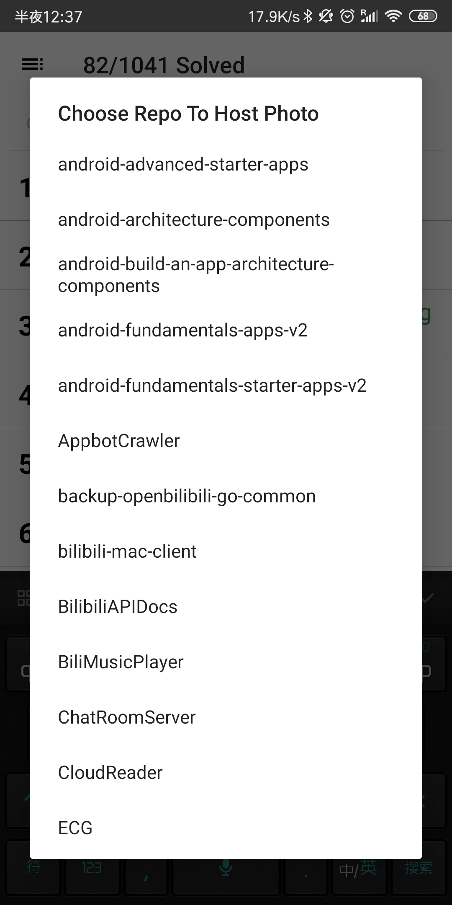
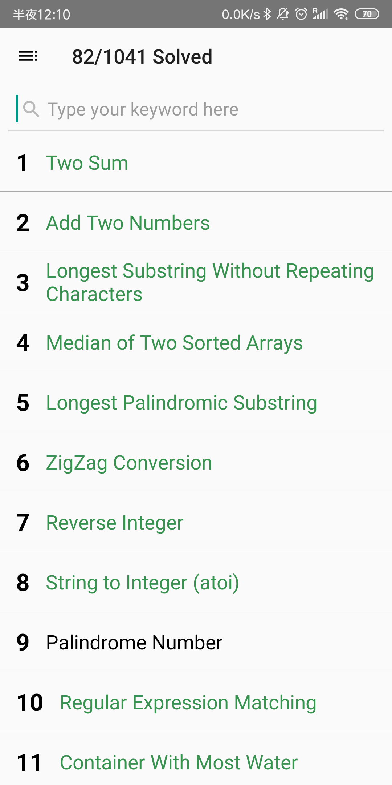
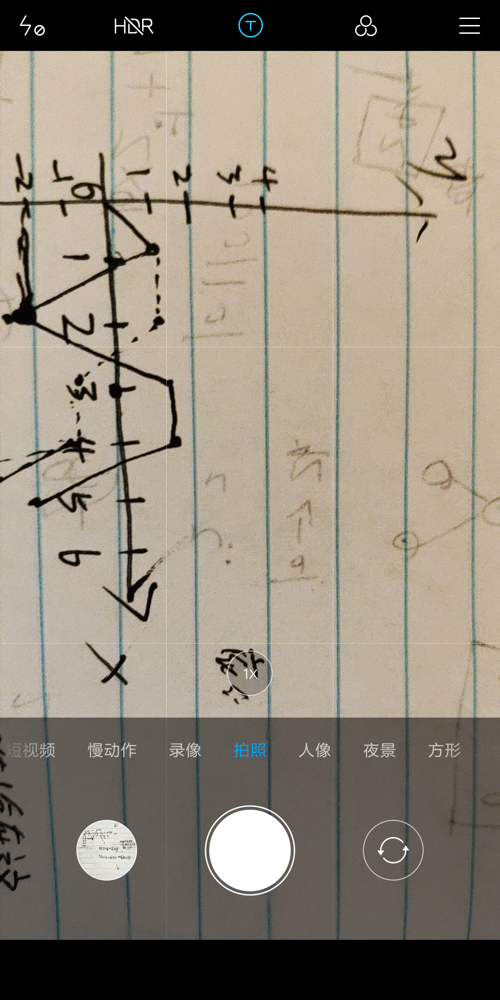
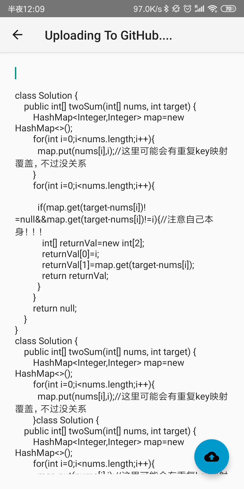
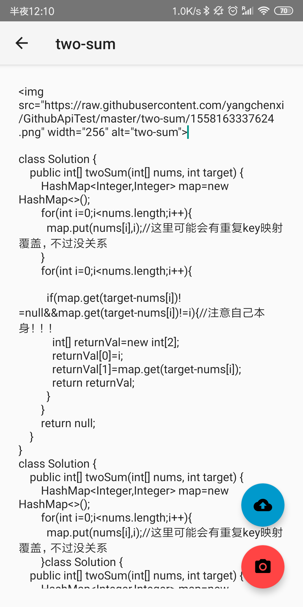
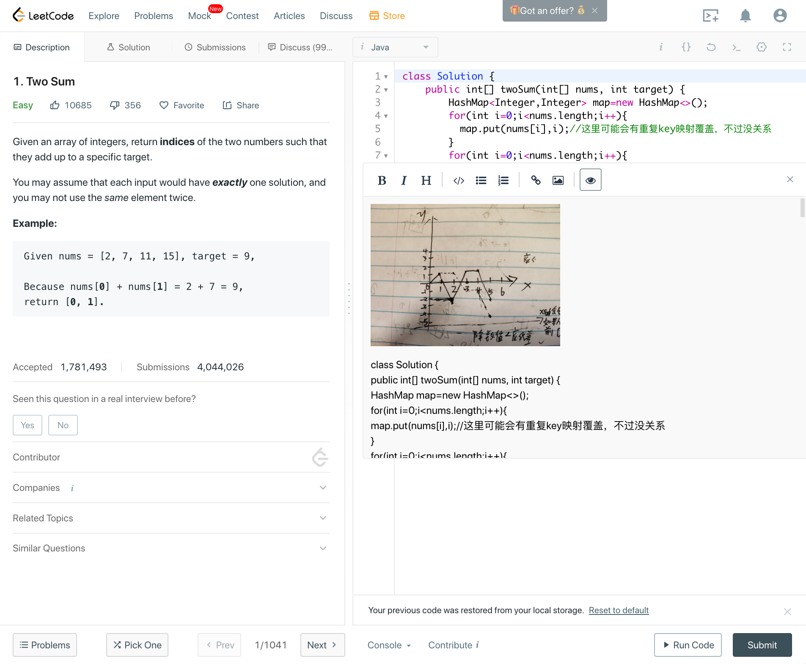

# LCNote

LCNoteEditor is an Android App helping Leetcode user take photo and add to their leetcode notebook.

Using your github repo to host photos.

Using **Oauth2.0** and Android WebView

Development DOC: [Document](./DOC/API.md)

## ScreenShots

| | | |
|:-------------------------:|:-------------------------:|:-------------------------:|
| |||

## Download

### [Release-V1.0 2019-05-18](https://github.com/yangchenxi/LCNoteEditor/releases/download/1.0/app-release.apk)

## License:

Copyright(c) 2019 Chenxi Yang

MIT License

